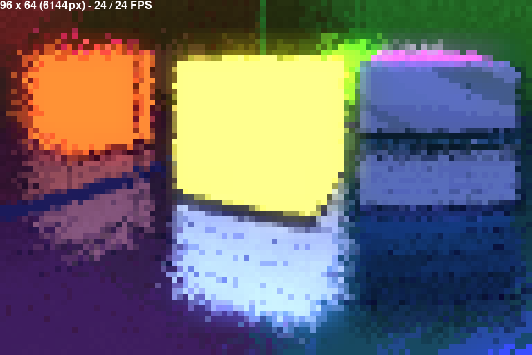

# Python Voxel Raytracer

Experimental CPU based voxel raytracing engine written in Python and based on Pygame. No meshes or textures: Everything is a floating point defined by a material. Materials can define their own functions as custom shaders. Designed for use at low resolutions and frame rates, the ray tracing algorithm is meant to be simple and efficient so expect noise and inaccuracy by design.



The code is under the GPL license, created and developed by MirceaKitsune. Execute `python3 ./init.py` to start the engine with the default test scene. Use the mouse to look around with the following keys:

 - `WASDRF`: Move forward, backward, left, right, up, down.
 - `Mouse wheel`: Fast move forward, backward, left, right.
 - `Arrows`: Look up, down, left, right.
 - `Tab`: Toggle mouse look and pointer grabbing.
 - `Shift`: Hold to move 5 times faster with the keyboard.

## Features and TODO

  - [x] Mod loader which allows launching the engine with any data package containing its own config and init script.
  - [x] Programmable material functions. Each voxel can hold both unique material properties as well as a function that tells light rays how to behave upon collision.
  - [x] Physically accurate material provided by default. Simulates all basic PBR features such as: Ray reflection and refraction with roughness, plasticity and metalicity with accurate color interactions, translucency and anisotropy with IOR support, density for volumetrics, emission via a ray energy system which supports ambient and sky lighting.
  - [x] Physics system which supports collisions between individual voxels. Physics properties such as weight friction or elasticity are calculated based on interactions with neighboring materials, allowing different surfaces in any object to have their own specific physical behaviors.
  - [ ] Add perlin noise. May be possible to support an object based chunk system for generating infinite terrain.
  - [ ] Create a script to convert image slices into pixel meshes. This will allow importing 3D sprites from 2D images.
  - [ ] Sound support in the form of either audio files or a frequency generator associated with materials. Audio is also intended to be raytraced.

## Settings

Settings are stored within the mod's `config.cfg` file and can be used to modify how the engine behaves. Below is a description of each category and setting:

  - `PHYSICS`: Physics related settings including player movement.
    - `speed_jump`: Jump speed of the player, determines how fast the player moves vertically.
    - `speed_move`: Keyboard movement speed of the player, determines how fast the camera moves when using the movement keys.
    - `speed_mouse`: Mouse rotation speed of the player, determines how fast the camera rotates when moving the mouse in mouselook mode.
    - `max_pitch`: Maximum pitch angle in degrees, the camera can't look lower or higher than this amount. 0 disables, use a value below 180, 90 is recommended.
  - `WINDOW`: Window related settings such as resolution and frame rate.
    - `width`: Number of horizontal pixels, higher values allow more detail but greatly affect performance.
    - `height`: Number of vertical pixels.
    - `scale`: The size of each pixel, acts as a multiplier to width and height.
    - `smooth`: If false pixels are always sharp, if true use a bilinear filter when upscaling to the `scale` factor.
    - `fps`: Target number of frames per second, the end result may be lower or higher based on practical performance. FPS will be lowered when the window is not focused.
  - `RENDER`: Renderer related settings used by the camera.
    - `ambient`: Ambient light intensity, light rays start with this amount of energy.
    - `static`: Whether to use the pixel index as random noise seed and have a static pattern, alternative to using random noise each frame which produces flickering. Affects material functions and camera effects such as DOF, pixel skipping is not affected and remains random.
    - `samples`: The number of samples to preform per pixel. Values higher than 1 enable multisampling, this makes each CPU thread process more than one image per frame. Looks softer and reduces roughness by doing multiple traces per pixel, but also reduces rendering performance and increases probability of banding: If not all samples are received during the same frame, they will be blended in random order and produce flickering.
    - `fov`: Field of view in degrees, higher values make the viewport wider.
    - `dof`: Depth of field in degrees, higher values result in more randomness added to the initial ray velocity and distance blur.
    - `dist_min`: Minimum ray distance, voxels won't be checked until the ray has preformed this number of steps.
    - `dist_max`: Maximum ray distance, calculation stops and ray color is returned after this number of steps have been preformed.
    - `terminate_hits`: Random chance that sampling stops after this number of hits. 0 disables bounces and allows direct hits only, 0.5 has a 50/50 chance of stopping at any step after the first bounce, 1 guarantees at least one bounce with no stopping, 1.5 adds a 50/50 chance of the second bounce not being stopped, 2 allows two bounces with no stopping, etc. Higher values improve performance at the cost of shorter distances and extra blur for reflections. By default this is multiplied by the `ior` material property and hits are represented by how much the ray was reflected.
    - `terminate_dist`: Probability that sampling stops earlier the further a ray has traveled. 0 disables and lets all rays run at their full lifetime, 0.5 allows probabilistic termination to occur from halfway through a ray's life, 1 may terminate all rays but those just spawned in front of the camera. Improves performance but introduces noise in the distance, distant object will fade into the background gradually which looks better.
    - `threads`: The number of threads to use for ray tracing by the thread pool, 0 will use all CPU cores. The screen is divided in vertical chunks so that each thread processes and draws a different area of the canvas, ensure `height` is larger than and equally divisible by the thread count.

## Default material settings

A material is registered using the `register_material` call with a list of settings. Below is a list of properties used to customize the default shader function or specify your own, unique properties are supported for use in custom material functions. Materials contain both visual properties that determine interactions with light rays, as well as physical properties controlling how objects collide with each other. Note that materials are global, changes done to a material will be immediately reflected on all voxels with that material.

  - `function`: Material function to call when a ray hits this material, use `material_default` unless you want a custom shader. 
  - `albedo`: The color of this material in RGB format, eg: `255, 127, 0`. Blended to the light ray based on the ray's absorption.
  - `roughness`: This amount of random roughness is added to the ray velocity when reflected or refracted, also controls energy reduction. Blurs reflections, if `density` is enabled this also blurs rays passing through. If the `static` setting is enabled this produces a consistent pattern otherwise high values will cause flickering.
  - `absorption`: The ability of this material to absorb color, 0 acts as a perfect mirror while 1 is a perfect absorbant. Controls both transparency and metalicity: Use with an `ior` under 0.5 to get a transparent surface and over 0.5 for a metallic one. If solid use 1 for plastic, 0.5 for metal, 0 for a mirror... if transparent try 1 for painted glass or 0.25 for fog.
  - `ior`: Amount by which light rays are reflected by or pass through the surface. This isn't an accurate IOR value and named that way for familiarity, it multiplies how much the ray is reflected and acts as the real controller for determining translucency. If the material represents an opaque surface this should be 1 for accurate ray bounces, lower slightly to simulate anisotropy... a value close to 0.5 can be used to send rays inward and encourage subsurface scattering... if transparent it should be well below 0.5 to send light rays through, use a low value to simulate IOR or 0 to leave ray velocity unchanged.
  - `energy`: How much energy this material emits. Use 0 for normal surfaces and increase for voxels that emit light. A flame should be roughly 0.25, a standard light bulb 0.5 or lower, the sun should be 1.
  - `solidity`: Physics property. Random chance that this material will be considered solid. When solid this voxel is checked during physics interactions and collides with voxels in other objects, otherwise this material is ignored by the physics system. Always use 1 for full solids like walls, 0 for non-solids such as fog, while an intermediary value such as 0.25 is ideal for fluids.
  - `weight`: Physics property used exclusively by actor objects, the cumulative value of all voxels on an object determines its overall weight. Makes an object heavier and pulled down faster by gravity, can be negative to make the object rise instead of falling. Does not affect interactions between different physical objects.
  - `friction`: Physics property used in interactions with actor objects, the property on the object's voxels is calculated against those of neighboring voxels. Influences the amount by which the object loses velocity over time when touching other surfaces. Note that no air friction exists by default and the void won't slow objects down: For air resistance create an invisible or fog material with a `solidity` of 0 and give it a small friction value.
  - `elasticity`: Physics property used in interactions with actor objects, the property on the object's voxels is calculated against those of neighboring voxels. Influences the amount by which an object's velocity is reflected when a solid surface is hit. If elasticity is 0 the object stops completely in that axis, if 1 the object will be bounced back at exactly the same speed it hit the surface with.

Note: The number of hits accounted for by the raytracer increases with `ior`, a value of 0 doesn't count as a hit while 1 is a full hit. Low reflectivity reduces bounce based ray termination controlled by the `terminate_hits` setting, making rays live longer which may degrade performance if a ray gets stuck bouncing inside a solid. An `ior` of 0 can be used to make volumetric fog, but since fog voxels are processed without reducing ray life this should be done sparingly to avoid performance loss.

## Material programming

The engine allows creating custom materials which can have their own functions telling light rays how to behave. By default each material uses the material_default function located in data.py which can be customized using the settings documented above, it's recommended to use the default material unless you're an advanced user and need a custom shader to do things not supported by the default ray behavior. Note that ray reflections are handled internally by the raytracer for optimal performance, material functions can make other changes to `ray.vel` after the ray has bounced.

A material function takes two parameters: The ray properties and the material we hit. Each function definition should thus be of the form `material_custom(ray, mat)`. See the default material section for the properties of the default material, eg: `mat.albedo` can be used to read color. Custom material settings are allowed for use in custom functions, as are custom ray properties which can be used to store data between ray hits. The following ray properties are used internally by the raytracer:

  - `col`: The color the ray has so far. This is usually the most important property to modify. If this is the first bounce col will be None instead of RGB, always check for its existence before preforming modifications.
  - `absorption`: Ability of this ray to change its color, should be modified based on the `absorption` setting of the material being hit. Color mixing should always be done based on this value, eg: `ray.col.mix(mat.albedo, ray.absorption)`. Starts at 1 and should be decreased by opaque hits that lack metalicity. Lower values blend future colors with less intensity, once 0 the color should no longer be changed.
  - `energy`: The amount of light the ray carries. `col` is multiplied by this value when applied to the screen. Starts out at the `ambient` configuration: This should decrease based on material metalicity or roughness, as well as increase when an emissive surface is hit.
  - `pos`: Current ray position. This should not be changed directly unless there's a reason to teleport the ray.
  - `vel`: Current ray velocity. The speed of light is 1, meaning at least one axis must be precisely -1 or +1 while the other two may be anything in that range: `vec3.normalize` is automatically ran after making changes, otherwise values `> abs(1)` will cause voxels to be skipped while values `< abs(1)` can cause the same voxel to be calculated twice!
  - `step`: The number of steps this ray has preformed. 1 is a ray that was just spawned at the camera's minimum draw distance, if `step` equals `life - 1` this is the last move the ray will preform. Only modify this if you want to give the ray a one time boost, change `life` to properly alter the lifetime.
  - `life`: The maximum number of steps this ray can preform before the resulting color is drawn. Starts at `dist_max - dist_min`, modifying this is the recommended way to make ray life shorter or longer.
  - `hits`: Represents the number of times this ray has bounced. The value is checked but not changed by the raytracer: The material function must increment this accordinfly to indicate how many bounces were preformed otherwise some features may not work correctly! Add 1 for a fully opaque bounce, a value between 0 and 1 to represent transparency for translucent voxels.

Sky function: In addition to material functions which are executed when the ray touches a voxel, a background function will preform changes to the ray after it has preformed its last step. Set the background variable in the data script to the default or your custom function such as `data.background = builtin.material_sky`, if omitted rays hitting the void will be black. Unlike conventional materials the sky function doesn't have settings since only one exists and it operates in place, the only parameter is thus the `ray` object. There's no point in changing positional ray properties here as this always runs after the last step: You typically want to use velocity to produce a shape at infinite distance based on ray direction.

## Creating a scene

This describes the procedure for setting up a custom scene. The engine is in early development and anything mentioned here is subject to change! The first step is to setup your own mod: Simply create a new directory in the mods folder, it needs to contain your own copy of `config.cfg` as well as an `init.py` script that will execute before the main window is created, simply run the engine with your mod as an argument for example `init.py default` to launch the default world. At the moment sprites can only be painted via code, importing sprites from image slices is a planned feature.

There are 3 main components to a scene: Materials, sprites, objects. Each acts as a subset of the other: Materials are points with unique properties acting as atoms, sprites are 3D textures storing materials located at different points, objects hold a set of sprites which they express in 3D space. The first step is creating one or more materials as described above and customizing their properties to get the types of surface you want, afterward paint a 3D sprite with your materials by adding each one at the correct location to form a shape, lastly create an object and give it the newly painted sprite. Materials and sprites can be retroactively modified with immediate results, always clone when you wish to customize one independently. Below is a simplified example of setting up a basic scene, does not include the mandatory player object which needs to be set in a similar way (see `object.set_camera`).

```
mat = data.Material(function = builtin.material, albedo = rgb(255, 127, 0))
spr = data.Sprite(size = vec3(16, 16, 16), frames = 1)
spr.set_voxel_area(0, vec3(0, 0, 0), vec3(15, 15, 0), mat)
obj = data.Object(pos = vec3(0, 0, 0))
obj.set_sprite(spr)
```

The above will create an orange wall covering the -Z face of the 16x16x16 sprite. Note that the maximum position we can set a voxel at is 15 although the size is 16, the count starts from 0 so 1 must be subtracted. When created sprites are given a number of animation frames, in this case the sprite is static so only one frame was provided: The first parameter of `set_voxel` or `set_voxel_area` is the frame we're editing in this case 0.

Below is a list of functions built into each class which are likely to be used when designing your own world. Read the code comments above every definition inside data.py where each class is defined for more technical information on other builtin functions, as well as the default scene for a full example of how everything is set up.

  - `*.clone`: Works on both materials sprites and objects. Returns a copy of the item which can be edited intependently, if not used changes to any reference of an existing instance will be applied to all instances. Duplicating too many items can decrease performance so use this sparingly and only when necessary.
  - `sprite.get_rotations`: Returns a tuple containing self alongside 3 rotated clones of the sprite, representing each possible rotation around the Y axis in a clockwise order (0, 90, 180, 270). Use this if you want the model to change with object angle, in which case the can be given `*sprite.get_rotations()` instead of just `sprite`. If you have your own images for each rotation you can use them instead of this function. Note that only sprites with the same X and Z size can be rotated, the scale on the Y axis is allowed to be different.
  - `sprite.rotate`: Rotates the sprite by the given number of degrees: 1 = 90*, 2 = 180*, 3 = 270* respectively. Normally you want `get_rotations` to get all possible angles and shouldn't need to use this directly.
  - `sprite.flip`: Can be used to mirror the sprite across the axes that are true. Using `flip(True, False, True)` has the same result as `rotate(2)` and can be used to do a 180* rotation on sprites of uneven size.
  - `sprite.mix`: Used to mix another sprite with this one, similar to overlaying two transparent images. Empty spaces in the other sprite are ignored and won't override voxels in this sprite, otherwise each material will be copied to this sprite. Both sprites must have the same size on all axes, sprites of different sizes can't be mixed.
  - `sprite.clear`: Removes all voxels from the given frame, use this to empty a frame before painting a new voxel mesh to it.
  - `sprite.set_voxel`: Sets the material at a single voxel position on the given frame of the sprite. For example `set_voxel(0, vec3(0, 0, 0), material)` will cause the first voxel to become that material. `None` can be provided in place of a material to clear the voxel.
  - `sprite.set_voxel_area`: Same as `set_voxel` but fills an entire area. For example `set_voxel_area(0, vec3(0, 0, 0), vec3(15, 15, 15), material)` will fill a 16x cube with the material.
  - `sprite.anim_set`: Sets the animation to be played on the sprite. For performance and efficiency, animations aren't named internally but each frame is stored in a single list: You must note and specify your own range to play animations. Example: `anim_set(10, 20, 0.5)` will play frames 10 through 19 at a rate of 500 ms. Note that the last frame will be ignored. Speed can be negative to play the animation backwards or 0 to make the sprite static again.
  - `object.remove`: Use this to permanently delete an object from the world and stop it from being processed. Materials sprites and objects are removed from memory if every reference to them is also deleted.
  - `object.move`: Teleports the object to the given `vec3` position. If you don't plan on changing the position of the object in real time, provide the desired position as an object parameter on init instead.
  - `object.rotate`: Rotates the object by this `vec3` amount. Only Y axis rotation has any visual effect, the rest is used by the camera and other mods to determine direction. If the object was given 4 sprites, this will cause the sprite in use to automatically switch to the version closest resembling the new rotation... if the object has a single sprite this will update rotation without any visual changes.
  - `object.distance`: Takes a single `vec3` parameter, used to get the total distance in space from a point to the surface of this object based on its size. By default the camera only renders objects that are `dist_max` units close to the camera since rays beyond this range can't reach an object.
  - `object.intersects`: Takes two `vec3` parameters, used to check if another point or box is touching or within the bounding box of this object. If both vectors are equal this is a point, otherwise intersection with another bounding box will be checked.
  - `object.set_sprite`: Used to associate an object with a sprite, use after creating objects if they're meant to be rendered. The function takes either a single sprite of 4 sprites as its parameter: If one sprite is provided rotation will not change visually, if 4 sprites are given they represent each angle in order of 0* 90* 180* 270* and the active sprite is swapped by the `object.rotate` function. The object takes on the size of the sprite when this is used, if sprite is None the object will be disabled again.
  - `object.set_camera`: Used to bind the camera and input to an object, takes a `vec2` used to indicate the camera offset. This effectively marks the object as the active player: Must be executed on at least one object for rendering and input to work! Only one object at a time may act as the player.

Note: The size of a sprite needs to be an even integer for each direction otherwise slices located on edges may be ignored. For instance `6 4 12` is a valid sprite size, however `7 4 12` is invalid and will be automatically enlarged to `8 4 12`. This is due to voxels being located at integer positions while the center of each objects is always in the middle, size must therefore be equally divisible by two to ensure voxels are never 0.5 units away from the object center.

Physics: To make an object physical, give it the `actor` property on init such as `data.Object(pos = vec3(0, 0, 0), actor = True)`. Only do this for objects intended to move, all actors are affected by gravity and subject to processing by the physics engine.
